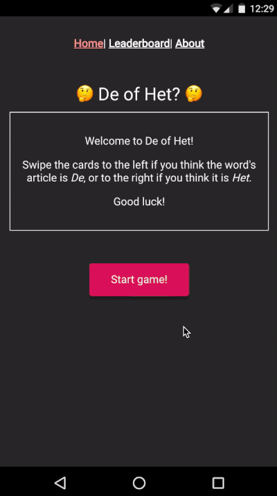

# De of Het

This project is an idea to help out who is learning Dutch. The Dutch language is pretty interesting, however there are certain things in the language that have no rules (such as using articles de or het), which makes it difficult to learn. This game brings a different yet fun way of memorizing articles and pronunciation of each word.

[Click here to play De of Het](http://de-of-het.netlify.com/)



## Project setup

```
yarn install
```

### Compiles and hot-reloads for development

```
yarn start
```

### Compiles and minifies for production

```
yarn run build
```

### Run your tests

```
yarn run test
```

### Lints and fixes files

```
yarn run lint
```

### Run your end-to-end tests

```
yarn run test:e2e
```

### Run your unit tests

```
yarn run test:unit
```

### Customize configuration

See [Configuration Reference](https://cli.vuejs.org/config/).
